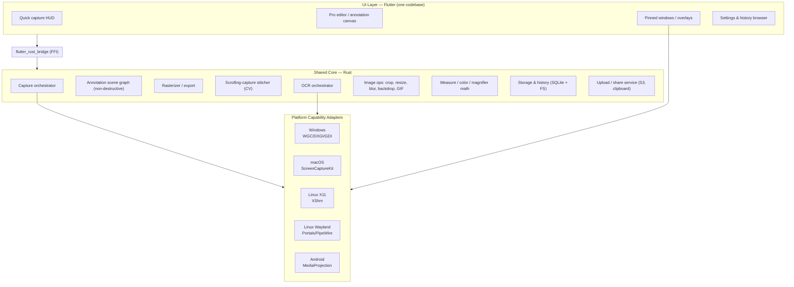

# ProShottr — Cross-Platform Build Plan

**A single screenshot & annotation product for Android, Linux (X11 + Wayland), Windows, and macOS**, combining WeChat's *speed-to-share* simplicity with Shottr's *pro-precision toolset*.

> This plan implements every feature catalogued in [feature.md](feature.md). Read that first for the feature source-of-truth; this document is the *how*.

---

## Table of Contents

1. [Vision, Goals & Principles](#1-vision-goals--principles)
2. [Target Platforms & Platform Realities](#2-target-platforms--platform-realities)
3. [Technology Stack Decision](#3-technology-stack-decision)
4. [System Architecture](#4-system-architecture)
5. [Cross-Platform Capability Layer](#5-cross-platform-capability-layer-the-contracts)
6. [Complete Feature Catalog → Module Mapping](#6-complete-feature-catalog--module-mapping)
7. [Platform-Specific Implementation Notes](#7-platform-specific-implementation-notes)
8. [Deep Dives on the Hard Features](#8-deep-dives-on-the-hard-features)
9. [Data Model & Persistence](#9-data-model--persistence)
10. [Cloud, Sync & Sharing](#10-cloud-sync--sharing)
11. [UI/UX Design](#11-uiux-design)
12. [Security, Privacy & Permissions](#12-security-privacy--permissions)
13. [Performance Targets & Budgets](#13-performance-targets--budgets)
14. [Testing & QA Strategy](#14-testing--qa-strategy)
15. [Packaging, Distribution & Auto-Update](#15-packaging-distribution--auto-update)
16. [Development Roadmap (Phased Milestones)](#16-development-roadmap-phased-milestones)
17. [Risks, Unknowns & Open Questions](#17-risks-unknowns--open-questions)
18. [Success Metrics](#18-success-metrics)
19. [Appendix A: Full Feature Parity Checklist](#appendix-a-full-feature-parity-checklist)

---

## 1. Vision, Goals & Principles

**Vision:** One fast, native-feeling capture tool everywhere, where the *default* path is as frictionless as WeChat (capture → mark up → send) and the *pro* tools (scrolling capture, OCR, measurement, color, magnifier) are one keypress away — as deep as Shottr.

### Product goals
- **Universal:** Android, Windows, macOS, Linux (both X11 and Wayland).
- **Fast:** capture-to-editor under ~100 ms on desktop (Shottr's bar is ~165 ms).
- **Two-speed UX:** a "Quick" flow for casual sharing; a "Pro" editor for precision.
- **Local-first:** everything works offline; cloud is optional and opt-in.
- **Consistent, non-destructive editing:** annotations are re-editable vector objects, never baked in until export.

### Engineering principles
| Principle | Consequence |
|---|---|
| **One core, many shells** | Perf-critical logic lives once in a shared native core; each platform contributes only capture/overlay/permission adapters + UI glue. |
| **Abstraction at the OS seam** | Every OS-specific capability sits behind a trait/interface with a per-platform implementation. |
| **Non-destructive by default** | The editor manipulates a vector scene graph; rasterization happens only on export/copy. |
| **Native capture, portable UI** | Use each OS's best capture API; keep a single UI codebase. |
| **Progressive permissions** | Ask only when a feature is first used; degrade gracefully when denied. |
| **Keyboard-first, mouse-complete** | Every action has a shortcut (Shottr ethos) but is also reachable by pointer/touch. |

---

## 2. Target Platforms & Platform Realities

Screenshot tools are unusually OS-coupled: capture, global hotkeys, always-on-top overlays, and clipboard all differ per platform. The single hardest surface is **Wayland**, whose security model forbids arbitrary screen reads — everything goes through a consent-brokered portal. Android is a different paradigm entirely (sandboxed, consent-per-session capture, no global hotkeys).

| Platform | Capture API (recommended) | Global hotkey | Always-on-top overlay / pin | Region-select overlay | Key constraint |
|---|---|---|---|---|---|
| **Windows 10/11** | Windows.Graphics.Capture (WGC); DXGI Desktop Duplication for full-screen; PrintWindow/GDI fallback | `RegisterHotKey` | Layered top-most window (`WS_EX_LAYERED\|WS_EX_TOPMOST`) | Full-screen transparent click-through window | WGC needs 1803+; GDI can't grab some HW-accelerated/UWP surfaces |
| **macOS 12.3+** | ScreenCaptureKit; `CGWindowListCreateImage` fallback | `CGEventTap` / Carbon `RegisterEventHotKey` | Borderless `NSPanel`, `.floating` level | Full-screen borderless overlay window | **Screen Recording TCC permission** required; hardened runtime + notarization |
| **Linux / X11** | `XShmGetImage` (MIT-SHM) / `XGetImage` | `XGrabKey` (or WM) | override-redirect window + `_NET_WM_STATE_ABOVE` | override-redirect full-screen window | Multi-monitor geometry via XRandR; compositor quirks |
| **Linux / Wayland** | `org.freedesktop.portal.ScreenCast` (PipeWire) or `…Screenshot`; compositor protocols (`wlr-screencopy` on wlroots) | `org.freedesktop.portal.GlobalShortcuts` (varies by compositor) | `wlr-layer-shell` (wlroots) / limited elsewhere | Compositor-mediated; can't freely draw fullscreen on all compositors | **No arbitrary screen grab** — consent prompt per portal session; per-compositor behavior differences |
| **Android 10+** | `MediaProjection` + foreground service (type `mediaProjection`) | N/A — use floating bubble / QS tile / notification action / share sheet | `SYSTEM_ALERT_WINDOW` (draw-over) | Overlay activity/window over the capture | Consent dialog per session (persistable via FGS); scrolling capture needs Accessibility |

**Design implication:** the capture and overlay subsystems must be *interfaces*, with 5 concrete backends (Win, macOS, X11, Wayland, Android). Wayland and Android get the most bespoke engineering.

---

## 3. Technology Stack Decision

We need: (a) one UI across desktop **and** mobile, (b) native-grade performance for capture/stitching/image ops, (c) a GPU-capable 2D canvas for the annotation engine, (d) access to raw OS APIs.

### Options considered

| Option | UI reach | Perf / size | Native OS access | Verdict |
|---|---|---|---|---|
| **A. Rust core + Flutter UI** (via `flutter_rust_bridge`) | ✅ Android + all 3 desktops, one UI | ✅ Rust core is fast/small; Flutter ships Skia (ideal annotation canvas) | Via platform channels + Rust FFI | **Recommended** |
| B. Rust core + Tauri (desktop) + native Android (Compose) | Desktop web UI + separate Android UI | ✅ tiny/fast | Excellent | Two UI stacks = double UI work |
| C. Fully native per platform (AppKit/Win32/GTK/Compose) + shared C++/Rust core | 4 UI codebases | ✅✅ best | ✅✅ best | Highest quality, highest cost |
| D. Electron (desktop) + separate mobile | Desktop only | ❌ heavy, large | Good | Fails "all devices" + Shottr's tiny/fast ethos |
| E. Pure Flutter (no Rust) | ✅ all | ⚠️ Dart is fine for UI, weaker for heavy image/stitch/CV | Plugins only | Viable MVP; weaker on scrolling-stitch & perf |

### Recommendation: **Option A — Rust shared core + Flutter UI**

**Why:** This is a proven combination for exactly this problem shape — RustDesk ships a Rust core with a Flutter UI across Windows/macOS/Linux/Android, using MediaProjection on Android and PipeWire/portals on Wayland. It gives us:
- **One UI codebase** (Dart/Flutter) for Android + Windows + macOS + Linux.
- **A fast, portable core** (Rust) for capture orchestration, scrolling-stitch computer vision, image processing, annotation scene model, OCR orchestration, and upload — shared verbatim on every platform, including Android via JNI/NDK.
- **Skia out of the box** in Flutter for a smooth, GPU-accelerated annotation canvas.
- Small binaries and native speed, honoring Shottr's ethos.

> This is a recommendation, not a mandate. If the team has zero Rust experience and wants the fastest MVP, **Option E (pure Flutter)** is an acceptable v1 that can later absorb a Rust core for the heavy features. If maximum per-platform polish is the priority over cost, **Option C** wins. The rest of this plan assumes **Option A** but is structured so the capability layer (§5) is stack-agnostic.

### Concrete stack (Option A)

| Layer | Technology |
|---|---|
| Shared core | **Rust** (image = `image`/`imageproc`, CV/stitching = `opencv`/custom, async = `tokio`, upload = `aws-sdk-s3`/`reqwest`) |
| Core⇄UI bridge | **`flutter_rust_bridge`** (Dart⇄Rust FFI codegen) |
| UI | **Flutter** (Material/Cupertino-agnostic custom design system; `CustomPainter`/Skia for the canvas) |
| Desktop capture/overlay | Native plugins: Win32/WinRT (Rust `windows` crate), ScreenCaptureKit (Swift/ObjC shim), X11 (`x11rb`), Wayland (`ashpd` portals + `wayland-client`) |
| Android capture/overlay | Kotlin: `MediaProjection`, foreground service, `SYSTEM_ALERT_WINDOW`, Accessibility service |
| OCR | Per-platform native (Vision / Windows.Media.Ocr / ML Kit) behind one trait, with **Tesseract**/**PaddleOCR** fallback for Chinese & uniformity |
| Global hotkeys | Rust per-OS impls + Wayland GlobalShortcuts portal + Android tile/bubble |
| Storage | SQLite (`rusqlite`) for history/index; filesystem for images; JSON/CBOR for the annotation scene |

---

## 4. System Architecture



### Module responsibilities (Rust core)

| Module | Responsibility |
|---|---|
| `capture` | Trait `ScreenCapturer` + per-OS backends; enumerate displays/windows, grab frames, region crop, delayed/repeat capture. |
| `scene` | The non-destructive document: ordered vector objects (shapes, arrows, text, blur regions, spotlights, step badges), z-order, styles, undo/redo stack. |
| `render` | Composite base image + scene → raster (PNG/JPEG/auto), export scales, before/after GIF encoder. |
| `scroll` | Frame de-dup, overlap detection (template/feature matching), sticky header/footer handling, long-image stitcher. |
| `ocr` | Trait `TextRecognizer` + backends; area OCR, QR decode, line-break stripping, language selection, translate hook. |
| `imageops` | Crop, resize, pixelate/mosaic/erase (incl. text-only mode), backdrop (gradient/shadow/rounded), overlay/opacity compositing. |
| `measure` | Ruler math, distance-between-objects, logical↔physical px, contrast (WCAG 2.0 + APCA), color formats (HEX/OKLCH), average color. |
| `store` | History index (SQLite), dedicated save folders, auto-save/auto-copy, format & naming rules. |
| `share` | Clipboard, drag-export payloads, S3-compatible upload, "send to <target>" intents. |
| `hotkeys` | Registration/dispatch abstraction across OSes and the Wayland/Android substitutes. |
| `settings` | Preferences model, hotkey map, notification prefs, telemetry opt-in. |

---

## 5. Cross-Platform Capability Layer (the contracts)

Everything OS-specific hides behind these interfaces. Each has 5 implementations (Win/macOS/X11/Wayland/Android). This is the crux that makes "all devices" tractable.

```
trait ScreenCapturer {
    fn list_displays() -> Vec<Display>;
    fn list_windows() -> Vec<WindowInfo>;
    fn capture_region(rect, display) -> Frame;      // area
    fn capture_window(id, opts) -> Frame;           // window + shadow/backdrop opts
    fn capture_display(display) -> Frame;           // fullscreen
    fn begin_stream(target) -> FrameStream;         // for scrolling & recording
    fn supports(feature) -> bool;                   // capability probe (e.g. Wayland can't freehand-grab)
}

trait OverlayHost {           // region selection UI + pins
    fn show_selection_overlay(...) -> SelectionResult;
    fn create_pin_window(image, opts) -> PinHandle;
    fn set_topmost(handle, bool);
}

trait HotkeyManager {
    fn register(id, chord) -> Result;   // desktop
    fn platform_trigger_surface();      // Android tile/bubble; Wayland portal
}

trait TextRecognizer { fn recognize(image, langs) -> OcrResult; fn decode_qr(image) -> Vec<Qr>; }

trait ClipboardService { fn put_image(...); fn put_text(...); fn get_color_at(...); }

trait PermissionBroker { fn ensure(cap: Capability) -> PermissionState; } // screen-record, overlay, accessibility, files
```

`supports()`/`ensure()` let the UI **gray out or reroute** features that a given platform/permission state can't provide (e.g., a Wayland compositor without GlobalShortcuts falls back to a tray/portal trigger).

---

## 6. Complete Feature Catalog → Module Mapping

Every feature from [feature.md](feature.md), mapped to a module, cross-platform feasibility, and priority. **Priority:** P0 = MVP, P1 = v1.0, P2 = pro/v1.x, P3 = later. **Feasibility:** 🟢 straightforward · 🟡 needs per-platform work · 🔴 hard/limited on some platform.

> **Ground truth vs. research:** the WeChat rows below were originally written from documentation/secondary sources. §6.8 replaces that with an exact, hands-on, click-by-click spec captured by driving the real WeChat Desktop client (`Alt+A`) on 2026-07-22 — use §6.8 as the authoritative WeChat-parity target where the two disagree (they do, in a few places: see the callouts in §6.8).

### 6.1 Capture (from both apps)

| Feature | Source | Module | Feasibility | Priority | Notes |
|---|---|---|---|---|---|
| Global hotkey capture | Both | `hotkeys`+`capture` | 🟡 | P0 | Desktop native; Android = bubble/tile; Wayland = portal |
| Screen-freeze on capture | WeChat | `capture` | 🟢 | P0 | Snapshot then overlay a frozen bitmap |
| Region / area select | Both | `capture`+`OverlayHost` | 🟡 | P0 | Wayland region select is compositor-mediated |
| **Dimmed frozen-screen overlay + `+` crosshair** | WeChat(+) | `capture`+`OverlayHost` | 🟢 | P0 | On trigger the whole virtual desktop freezes and dims; a `+` crosshair marks the exact sampled pixel; the hovered window un-dims. Full spec: §8.8 |
| **Live cursor probe: coordinates + HEX + RGB, pre-drag** | WeChat(+) | `capture`+`measure` | 🟢 | P0 | A small box tracks the crosshair showing `LOC x,y`, `HEX #rrggbb` **and `RGB r,g,b`** before any drag — a free color-picker built into the selection step. WeChat shows LOC+HEX only (§6.8.1); the RGB line and swatch chip are ProShottr additions. Full spec: §8.8 |
| Auto window/UI detection on hover + **one-click window capture** | Both | `capture` | 🟡 | P0 | Detection re-runs whenever the crosshair crosses into a different window — same app or another app; a single left click captures the highlighted window, and click-and-drag overrides detection with a free region. Win/macOS/X11 window trees; Wayland limited. Full spec: §8.8 |
| Window capture (shadow/trim/backdrop) | Shottr | `capture`+`imageops` | 🟡 | P1 | |
| Fullscreen capture | Shottr | `capture` | 🟢 | P0 | |
| Multi-monitor / Retina/DPI aware | Shottr | `capture` | 🟡 | P0 | Per-display scale factors |
| **Scrolling screenshot** | Shottr(+WeChat-style long chats) | `scroll` | 🔴 | P2 | See §8.2; hardest feature |
| Delayed capture (timer) | Shottr | `capture` | 🟢 | P1 | |
| Repeat-area capture | Shottr | `capture` | 🟢 | P1 | Persist last rect |
| Auto-adjust/snap selection to edges | Shottr | `capture`+CV | 🟡 | P2 | Edge detection |
| Square-constrained selection | Shottr | `OverlayHost` | 🟢 | P1 | |
| Screen recording (video) | WeChat(new) | `capture` | 🟡 | P3 | Stretch; reuses `begin_stream` |

### 6.2 Annotation & Markup

| Feature | Source | Module | Feasibility | Priority | Notes |
|---|---|---|---|---|---|
| Rectangle / box | Both | `scene` | 🟢 | P0 | **Verified:** WeChat's Rectangle draws a **filled** solid-color shape by default, not just an outline — asymmetric with Ellipse below. Decide deliberately whether ProShottr's Rectangle defaults to filled or outline (§6.8.2). |
| Ellipse / circle | Both | `scene` | 🟢 | P0 | **Verified:** WeChat's Ellipse is **outline-only** (never filled) — confirmed distinct behavior from Rectangle in the same toolbar, same color swatch. |
| Arrow (straight) | Both | `scene` | 🟢 | P0 | Verified: solid arrowhead, color/stroke-width selectable, same 3-size stroke picker as other shapes. |
| Arrow (curved/bendable/reversible) | Shottr | `scene` | 🟢 | P2 | — |
| Freehand pen (smoothing, width variance) | Both | `scene` | 🟢 | P0/P2 | Verified (WeChat "Brush"): plain freehand line, no arrowhead, same color/stroke picker as Arrow/shapes. |
| Text labels (size/color/font) | Both | `scene` | 🟢 | P0 | Verified: WeChat offers exactly **3 font sizes** (small/medium/large "A" icons) + the shared color palette; click-to-place, type immediately. |
| Highlighter | Shottr | `scene` | 🟢 | P1 | — |
| Spotlight (dim + focus) | Shottr | `scene`+`render` | 🟢 | P2 | — |
| Step counter badges | Shottr | `scene` | 🟢 | P2 | — |
| Mosaic / pixelate | Both | `imageops` | 🟢 | P0 | **Verified + new requirement:** WeChat's Mosaic has a manual brush-size picker **and a dedicated "AI masking" toggle** for auto-detected sensitive-region masking (faces/text/etc.) — see §6.8.2 and add as its own sub-feature, not folded into manual mosaic. |
| Blur / erase (text-only mode) | Shottr | `imageops` | 🟡 | P2 | — |
| Hand-drawn/sketchy style | Shottr | `render` | 🟢 | P2 | — |
| Color palette per tool | Both | `scene` | 🟢 | P0 | Verified WeChat palette: blue / green / yellow / grey / white / red, shared across Rectangle/Ellipse/Arrow/Brush/Text, selected swatch gets a highlight ring. |
| Line thickness / stroke | Both | `scene` | 🟢 | P0 | Verified: exactly 3 dot-sized presets (thin/medium/thick), no arbitrary slider. |
| Emoji / stickers on capture | WeChat | `scene` | 🟢 | P2 | **Verified, bigger than assumed:** full picker panel with a **Recent** row, an **All Stickers** grid, and category tabs along the bottom — not a small inline strip. Placed stickers land centered in the selection and are repositionable. Scope this as a proper picker component, not a quick-pick row (§6.8.2). |
| Undo / redo | Both | `scene` | 🟢 | P0 | Verified: `Ctrl+Z` undo present; redo not confirmed during exploration — verify redo shortcut/button separately. |
| Object copy/paste, layering, snapping, move-while-draw, guides | Shottr | `scene` | 🟢 | P2 | — |

### 6.3 Image manipulation

| Feature | Source | Module | Feasibility | Priority |
|---|---|---|---|---|
| Crop | Shottr | `imageops` | 🟢 | P0 |
| Resize / scale | Shottr | `imageops` | 🟢 | P1 |
| Backdrop (gradient/shadow/rounded) | Shottr | `imageops` | 🟢 | P2 |
| Image overlay / semi-transparent compare | Shottr | `imageops`+`scene` | 🟢 | P2 |
| Before/after GIF | Shottr | `render` | 🟡 | P3 |
| Format select PNG/JPEG/auto | Shottr | `render` | 🟢 | P1 |

### 6.4 OCR & recognition

| Feature | Source | Module | Feasibility | Priority | Notes |
|---|---|---|---|---|---|
| Area OCR → clipboard | Both | `ocr` | 🟡 | P2 | Native per-OS engines; Tesseract/Paddle fallback |
| QR decode | Shottr | `ocr` | 🟢 | P2 | |
| Chinese + multilingual | Both | `ocr` | 🟡 | P2 | PaddleOCR strong for zh |
| Line-break removal toggle | Shottr | `ocr` | 🟢 | P2 | |
| Translate extracted text | WeChat | `ocr`+`share` | 🟡 | P3 | Pluggable translate provider |
| **OCR result viewer window** | WeChat | `ocr`+`OverlayHost` | 🟢 | P2 | **Verified & not previously modeled:** WeChat's "Extract Text" doesn't just copy silently — it opens a whole dedicated floating result window (image preview + a side panel listing every recognized text line, selectable/copyable) that also carries its own Translate/Save/Zoom/Rotate/pin/"…"-menu (Copy, Print, Forward, Add to Favorites, Open with default app). Model this as a real reusable `OverlayHost` surface, not a toast. See §6.8.3. |
| Translate & Extract Text greyed out on blank content | WeChat | `ocr` | 🟢 | P2 | Verified: both buttons are disabled until the selection actually contains recognizable photo/text content — mirror this affordance (don't offer OCR/translate on an empty or solid-color capture). |

### 6.5 Measurement, color, zoom

| Feature | Source | Module | Feasibility | Priority |
|---|---|---|---|---|
| Screen ruler (h/v) | Shottr | `measure` | 🟡 | P2 |
| Distance between objects | Shottr | `measure` | 🟡 | P2 |
| Logical↔physical px toggle | Shottr | `measure` | 🟢 | P2 |
| Color picker (HEX/RGB/OKLCH) | Shottr | `measure`+`ClipboardService` | 🟡 | P2 (HEX+RGB inside the capture overlay is P0 — §8.8) |
| Copy text color / average color | Shottr | `measure` | 🟢 | P2 |
| Contrast checker (WCAG/APCA) | Shottr | `measure` | 🟢 | P2 |
| Screen magnifier / pixel zoom | Shottr | `measure`+UI | 🟡 | P2 |

### 6.6 Output, pin, sharing, storage

| Feature | Source | Module | Feasibility | Priority | Notes |
|---|---|---|---|---|---|
| Copy to clipboard | Both | `share` | 🟢 | P0 | Verified: WeChat's green "Done" (✓) check button is the copy-to-clipboard confirm — completing the capture without an explicit save/send copies the annotated PNG. |
| Save to file / dedicated folder | Both | `store` | 🟢 | P0 | **Verified default behavior:** WeChat's Save opens a native OS save dialog pre-filled with a **timestamp-based filename** (e.g. `22_132136_668.png`) defaulting to a `Desktop\Temp`-style folder — i.e. it still prompts every time rather than silently auto-saving. ProShottr should offer both: a WeChat-style "prompt with smart default name/folder" **and** the Shottr-style silent auto-save toggle (row below). |
| **Send directly to destination/chat** | WeChat | `share` | 🟡 | P1 | OS share sheet + app deep-links; WeChat's signature flow. **Verification note:** during hands-on exploration this button was deliberately *not* clicked to confirm its exact semantics (immediate send vs. attach-to-compose-box), because doing so on a live account risks actually posting an image to a real contact/group — re-verify in a disposable/test chat before finalizing the deep-link UX copy. Surfaced as the share button in the Quick HUD action group (§8.9). |
| Pin to screen (float, always-on-top) | Both | `OverlayHost` | 🟡 | P1 | **Verified:** WeChat's pin produces a small, freely movable, always-on-top window with its own minimize + close controls (not just a borderless overlay) — model the pin surface as a lightweight real window, see §6.8.4. Surfaced as the pin button in the Quick HUD action group (§8.9). |
| Pin scroll-to-resize | Shottr | `OverlayHost` | 🟢 | P2 | |
| Auto-save / auto-copy | Shottr | `store` | 🟢 | P1 | |
| S3-compatible upload + manage | Shottr | `share` | 🟢 | P2 | |
| Drag-and-drop export | Shottr | `share` | 🟡 | P2 | Desktop drag payloads |
| Hide app window during capture | WeChat | `capture` | 🟢 | P0 | Stronger than hiding: the whole capture session presents no app window at all — no taskbar button, no Alt-Tab entry — until the user explicitly opens an editing surface. Full rule: §8.10 |
| Capture resolution badge over the capture | Both | `capture`+UI | 🟢 | P0 | `W × H` in physical pixels, shown with the editing toolbar, anchored to the capture's top-left. §8.9 |

### 6.7 Platform, automation, prefs

| Feature | Source | Module | Feasibility | Priority |
|---|---|---|---|---|
| Custom hotkey mapping | Both | `hotkeys`+`settings` | 🟡 | P1 |
| URL-scheme / automation API | Shottr | `share`/IPC | 🟡 | P3 |
| Launcher integrations (Raycast/Alfred/QS tile) | Shottr | platform | 🟡 | P3 |
| Notification controls | Shottr | `settings` | 🟢 | P1 |
| Telemetry opt-in | Shottr | `settings` | 🟢 | P1 |
| Auto-update | Shottr | packaging | 🟡 | P1 |
| Theming / i18n (zh/en+) | Both | UI | 🟢 | P1 |

### 6.8 WeChat Screenshot Tool — Verified Reference Spec (hands-on exploration, 2026-07-22)

Everything in this subsection was captured by actually driving WeChat Desktop for Windows (`Alt+A`) end-to-end — every tool clicked, every sub-panel opened, every tooltip read — rather than inferred from documentation. Where it corrects or adds detail beyond the rows in §6.1–§6.7 above, those rows now cross-link back here. Treat this as the literal parity target for ProShottr's Quick HUD (§8.7, §11).

#### 6.8.1 Trigger & selection stage
- Trigger: `Alt+A` while WeChat is the focused/foreground app → full-screen crosshair overlay.
- The crosshair itself is a mini tool: it live-displays `LOC x,y` (pixel coordinates) and `HEX #rrggbb` (color under cursor) **before** any drag starts — effectively a zero-extra-step color picker built into the capture trigger.
- Click-drag defines the rectangular region; a `width x height` label tracks live above the selection.
- Green corner/edge handles let you resize the region after the initial drag, before confirming.
- **Design implication:** ProShottr's `OverlayHost` selection step should support the same live coordinate+color HUD by default — it's cheap (reads the frozen frame buffer already captured for §8.1) and removes a whole separate "color picker" mode for the common case.

#### 6.8.2 Annotation toolbar — draw tools (verified, left-to-right)
| # | Tool | Verified behavior |
|---|---|---|
| 1 | **Rectangle** | Draws a **filled** solid-color rectangle — not outline-only. |
| 2 | **Ellipse** | Draws an **outline-only** ellipse — confirmed asymmetric with Rectangle in the same session. |
| 3 | **Sticker** | Opens a full picker: **Recent** row + **All Stickers** grid + category tabs along the bottom. Placed sticker centers itself in the selection; appears repositionable. |
| 4 | **Arrow** | Straight line, solid arrowhead. |
| 5 | **Brush** (pen) | Freehand line, no arrowhead. |
| 6 | **Mosaic** | Manual pixelate brush **plus** a distinct **"AI masking" toggle** button in its sub-toolbar — implies automatic detection of sensitive regions (faces/text) vs. purely manual dragging. Not visually confirmed against real faces/text in this pass (test region had neither) — flagged as a follow-up. |
| 7 | **Text (T)** | Click-to-place, type immediately; sub-toolbar = 3 font sizes (small/medium/large) + color palette. |

Shared sub-toolbar for tools 1, 2, 4, 5, 6: **3 stroke-width presets** (thin/medium/thick, not a slider) + a **6-swatch color palette** (blue, green, yellow, grey, white, red); the active swatch/size gets a highlight ring.

**Design implication:** don't default every shape tool to the same fill rule — WeChat's own toolbar isn't internally consistent (Rectangle fills, Ellipse doesn't), which is worth a deliberate decision rather than an assumption. Also model Sticker as a full picker component (categories + recents), not a 6-icon quick-row, and give Mosaic two explicit modes (manual brush vs. AI auto-mask) as first-class, separately toggleable behavior.

#### 6.8.3 AI/content tools — Translate & Extract Text
- Both are **greyed out** over a blank/solid-color selection and only enable once the region contains real photo/text content.
- **Extract Text (OCR)** doesn't just copy silently to clipboard — clicking it converts the capture into a dedicated floating **"Screen Capture" window**:
  - Left: the image preview (with its own Sticky/pin, Back/Forward history, Zoom/Shrink, Original-size, Rotate, and Edit-to-reopen-annotation-toolbar controls).
  - Right: a side panel listing every OCR'd line of text (verified against a real chat screenshot — correctly extracted the usernames "Miao", "Xiaoyao Luotuo", "Miao:"), selectable/copyable.
  - A **"…" overflow menu** with: Copy, Print, Forward…, Add to Favorites, Open with the default (app).
  - Also carries its own Translate and Save actions independent of the original capture toolbar.
- **Translate**, when clicked on content with no translatable sentence text (e.g. already-Latin usernames), simply closes the OCR panel with no visible translation result — behavior on genuine foreign-language text is unverified (follow-up).
- A third icon (exclamation-in-a-box) sits alongside Translate/Extract Text, also greyed out on blank content — not conclusively identified; likely a secondary detection/QR-style feature.

**Design implication:** model "Extract Text" as opening a real secondary `OverlayHost` surface (persistent window, its own toolbar, its own history/back-forward), not a transient toast or inline panel — this is a bigger feature surface than "OCR → clipboard" implies. See the new row in §6.4.

#### 6.8.4 Action buttons (right-hand group)
| Button | Verified behavior |
|---|---|
| **Undo** (`Ctrl+Z`) | Steps back the last annotation. |
| **Save** | Native OS "Save As" dialog, pre-filled with a timestamp filename (e.g. `22_132136_668.png`), defaulting to a `Desktop\Temp`-style folder — always prompts, doesn't silently write. |
| **Pin to Desktop** | Spawns a small, freely movable, always-on-top floating window with its own minimize/close controls — a real lightweight window, not just a borderless layer. |
| **Send to Chat** | Tooltip-confirmed only; not actually triggered in this pass (would post to a real contact/group — see the caution note in §6.6). Exact semantics (instant-send vs. attach-to-compose-box) still need verification in a safe/disposable chat. |
| **Quit** (✕, red) | Discards the whole capture session. |
| **Done** (✓, green) | Confirms/finishes — copies the annotated image to the clipboard. |

#### 6.8.5 Layout adaptivity (edge case, worth being aware of)
On a narrow selection, the toolbar's icon layout can shift/compress — in one test, some draw-tool icons weren't in their usual position and the toolbar re-centered starting further left than the selection's own left edge. **Implication:** ProShottr's Quick HUD toolbar needs an explicit narrow-selection layout rule (e.g. overflow into a "more tools" flyout) rather than assuming the full tool row always fits — don't let it silently reposition in visually surprising ways.

#### 6.8.6 Confirmed open follow-ups
1. **AI masking** (Mosaic) — retest against a region with real faces/visible text to confirm auto-detect behavior.
2. **Send to Chat** — confirm instant-send vs. attach-to-compose-box, in a context where sending is safe.
3. The unidentified exclamation/box icon next to Translate/Extract Text.
4. **Translate** — retest against genuine non-English source text to see the actual translation UI (this pass only had already-Latin text available).
5. **Redo** — undo (`Ctrl+Z`) was confirmed; a corresponding redo shortcut/button was not located during this pass.

---

## 7. Platform-Specific Implementation Notes

### 7.1 Windows
- **Capture:** `Windows.Graphics.Capture` (WGC) via the `windows` Rust crate for windows & displays (DPI/HDR-correct, GPU path). `DXGI Desktop Duplication` for fast fullscreen/recording. `PrintWindow`/GDI as a compatibility fallback for stubborn windows.
- **Hotkeys:** `RegisterHotKey` on a hidden message window; dispatch to core.
- **Overlays/pins:** transparent, click-through `WS_EX_LAYERED | WS_EX_TOPMOST | WS_EX_TRANSPARENT` window for region select; top-most layered window for pins.
- **Clipboard:** `CF_DIB`/`CF_PNG`.
- **Packaging:** MSIX + plain installer (Inno/NSIS); Authenticode signing; Squirrel/MSIX auto-update. Optional Microsoft Store.

### 7.2 macOS
- **Capture:** **ScreenCaptureKit** (12.3+) primary; `CGWindowListCreateImage` fallback for older/edge cases.
- **Permission:** Screen Recording (TCC) — detect state, deep-link to System Settings if denied.
- **Hotkeys:** Carbon `RegisterEventHotKey` or `CGEventTap`.
- **Overlays/pins:** borderless `NSPanel`, `NSWindow.Level.floating`, `collectionBehavior` for all Spaces.
- **Packaging:** hardened runtime, notarization, `.dmg`; Sparkle for auto-update; entitlements for screen capture. Optional Mac App Store (sandbox limits some features).

### 7.3 Linux — X11
- **Capture:** `XShmGetImage` (MIT-SHM shared memory, fast) with `XGetImage` fallback; XRandR for multi-monitor geometry & per-output scale.
- **Hotkeys:** `XGrabKey` on the root window (handle keyboard-grab conflicts).
- **Overlays/pins:** `override-redirect` fullscreen window for selection; `_NET_WM_STATE_ABOVE` for pins.
- **Clipboard:** X selections (`CLIPBOARD`), image targets.

### 7.4 Linux — Wayland (the hard one)
- **Capture:** no raw screen access. Use `ashpd` to drive `org.freedesktop.portal.ScreenCast` (returns a **PipeWire** stream) or `org.freedesktop.portal.Screenshot` for one-shots. On **wlroots** compositors (Sway/Hyprland) use `wlr-screencopy` directly (like `grim`) for a smoother, promptless path where allowed.
- **Region select:** compositor-mediated; where fullscreen overlay drawing is restricted, integrate a `slurp`-style selection or the portal's own picker. Use `wlr-layer-shell` for overlay surfaces on wlroots.
- **Hotkeys:** `org.freedesktop.portal.GlobalShortcuts` where supported; otherwise a tray/menu + compositor-configured keybind that invokes our D-Bus activation.
- **Detect environment:** probe `XDG_SESSION_TYPE`/`WAYLAND_DISPLAY` and available portals at runtime; fall back to X11 backend under XWayland only as last resort.
- **Reality:** behavior differs across GNOME (mutter), KDE (kwin), wlroots. Ship a **capability probe** and per-compositor test matrix.

### 7.5 Android
- **Capture:** `MediaProjection` via a **foreground service** (`foregroundServiceType="mediaProjection"`); host the system consent dialog in a transparent activity; persist the projection token for the session.
- **Trigger surfaces (no global hotkeys):** floating **bubble** (`SYSTEM_ALERT_WINDOW`), **Quick Settings tile**, notification action, and the system **share sheet** as an entry point.
- **Overlays/pins:** draw-over-apps window (`SYSTEM_ALERT_WINDOW`) for the floating editor and pins.
- **Scrolling capture:** `AccessibilityService` to programmatically scroll + continuous `MediaProjection` frames → core stitcher; or leverage the OS scrolling-screenshot where exposed. High permission cost — gate behind explicit opt-in.
- **OCR:** ML Kit on-device text recognition (incl. Chinese model).
- **Share:** Android Sharesheet + direct-share targets = the "send to chat" analog.
- **Packaging:** Play Store AAB + sideload APK; scoped storage / MediaStore for saves.

---

## 8. Deep Dives on the Hard Features

### 8.1 Capture pipeline
1. Hotkey/trigger → `PermissionBroker.ensure(ScreenRecord)`.
2. Grab a full frozen frame of the target display(s) (fast path per OS).
3. Show `OverlayHost` selection UI over the frozen frame (instant, no flicker).
4. On confirm → crop in core → route to Quick HUD or Pro editor per user setting.
5. Editor loads the raster as the scene's base layer; annotations added as vector objects.

### 8.2 Scrolling capture (highest-risk feature)
- **Desktop:** open a capture **stream** on the target window; programmatically send scroll events (or ask the user to scroll); capture frames; in the Rust `scroll` module, **detect vertical overlap** between consecutive frames via normalized cross-correlation / feature matching; **ignore sticky headers/footers** by detecting non-scrolling bands; stitch into one tall image; de-dup and correct for momentum/overscroll.
- **Android:** `AccessibilityService` performs `ACTION_SCROLL_FORWARD` steps; same stitcher consumes MediaProjection frames.
- **Wayland:** constrained — rely on the PipeWire stream + user-driven scroll; may be degraded on some compositors (document the limitation, `supports()` = false where impossible).
- **Fallbacks:** manual "capture next frame" mode when auto-scroll is blocked.

### 8.3 Annotation engine (non-destructive)
- A **scene graph**: ordered list of typed objects (`Rect`, `Ellipse`, `Arrow`, `Path`, `Text`, `BlurRegion`, `Spotlight`, `StepBadge`, `ImageOverlay`) each with transform, style, and z-index.
- **Undo/redo** = command stack over the scene.
- **Rendering:** Flutter `CustomPainter`/Skia paints the live canvas; the Rust `render` module produces the final raster on export/copy so output is identical headless (for CLI/automation).
- **Serialization:** scene saved as JSON/CBOR alongside the base image → fully re-editable `.proshot` documents.

### 8.4 OCR subsystem
- One `TextRecognizer` trait, best-per-platform backend: **Vision** (macOS/iOS-class quality), **Windows.Media.Ocr** (Windows), **ML Kit** (Android). Desktop Linux + any Chinese-heavy case → **PaddleOCR**; **Tesseract** as the universal fallback and for offline uniformity.
- Post-process: line-break stripping, layout-aware ordering, QR via `zxing`/`rqrr`.
- Translate is a separate pluggable provider (offline model or API), off by default (privacy).

### 8.5 Pin-to-screen
- `OverlayHost.create_pin_window`: borderless, always-on-top, draggable, scroll-to-resize, opacity control, quick actions (copy/save/close/annotate). Backends: NSPanel / layered Win / wlr-layer-shell / SYSTEM_ALERT_WINDOW.

### 8.6 Measurement, color, magnifier
- Pure math in core over the frozen frame buffer: ruler (px between guides), average/point color sampling, WCAG 2.0 + APCA contrast, format conversion (HEX/HEX-no-#/OKLCH). Magnifier = zoomed sampling of the frame buffer under cursor; logical↔physical px from the display scale factor.

### 8.7 Global hotkeys & the quick-share flow
- Desktop: real global hotkeys. Android/Wayland: substitute triggers (bubble/tile/portal).
- **Quick flow (WeChat-style, verified spec in §6.8):** capture → live coordinate/color crosshair while selecting → minimal floating toolbar (rect [filled], ellipse [outline], sticker picker, arrow, brush, mosaic [manual + AI-masking toggle], text, undo) → primary button = **Send/Share** (OS sharesheet or configured target), secondary = copy/save/pin. Pro editor is one keypress away for the deep toolset.
- Both stages of that flow have literal, implementable specs of their own: **§8.8** for the capture-trigger overlay (dim, crosshair, probe box, window auto-detect) and **§8.9** for the post-capture editing toolbar.

### 8.8 Capture-trigger overlay — the pre-selection stage (spec)

This is everything that happens between pressing the capture hotkey and choosing what to capture. It is a P0 surface: it is the first thing a user sees every single time, so it carries the precision affordances (crosshair, probe box) rather than hiding them in a separate color-picker mode.

**Presentation rule.** This overlay, and the Quick HUD that follows it, are not an application window — see **§8.10** for the full rule and its per-platform mechanics.

**Trigger.** Default `Alt+Shift+S` on desktop, remappable (§6.7). Windows registers it via `RegisterHotKey` on the hidden message window (§7.1); macOS via `RegisterEventHotKey`; X11 via `XGrabKey`; Wayland via the `GlobalShortcuts` portal where the compositor supports it. Android substitutes bubble/tile/notification (§7.5).

**State machine.**

| State | Entered by | What is on screen |
|---|---|---|
| `Armed` | hotkey fires, frozen frame ready | Dimmed frozen desktop, crosshair, probe box, no selection |
| `WindowHover` | crosshair rests inside a detected window | Same, plus that window's rect un-dimmed and outlined |
| `Dragging` | primary button held and moved | Live rect un-dimmed, `w × h` label tracking it, probe box still live |
| `Selected` | drag released (or window clicked) | Rect with 8 resize handles, hand-off to the Quick HUD (§8.9) |
| `Dismissed` | `Esc`, right-click, or focus loss | Overlay torn down, original window state restored |

**Dimming and the crosshair.**
- The overlay paints the frozen full-virtual-desktop frame (§8.1), then a uniform dark wash (~40% black) over everything. The point is legibility of intent: the desktop reads as inactive and "not yet chosen".
- The OS cursor is replaced by a drawn `+` crosshair so the sampled pixel is unambiguous — an OS arrow cursor has a hot point several pixels away from what it looks like it points at. The crosshair is drawn in the overlay, not as a cursor bitmap, so it stays pixel-exact across DPI scales.
- Whatever is currently a capture candidate — the hovered window in `WindowHover`, the live rect in `Dragging` — is punched back out of the wash to full brightness.

**The probe box (next to the crosshair).** A small panel that follows the crosshair with a fixed offset, flipping to the other side and clamping vertically near screen edges so it is never clipped or off-screen. Contents, top to bottom:

| Line | Format | Notes |
|---|---|---|
| Coordinates | `LOC 1842,377` | Virtual-desktop pixel coordinates, so negative origins on left/above-primary monitors are reported honestly |
| Hex | `HEX #3A7BD5` | Uppercase, hash included |
| RGB | `RGB 58, 123, 213` | New requirement — same pixel as the hex line, never a rounded or re-quantized value |
| Swatch | filled chip | The sampled color itself, so near-identical values are still distinguishable at a glance |

- **Sampling source:** the already-decoded frozen frame buffer, never a fresh OS pixel read. The buffer exists anyway for the overlay, so the probe costs one array index and adds no capture latency.
- **Copy semantics:** `C` copies the hex, `Shift+C` copies `rgb(58, 123, 213)`; either copies and dismisses the overlay, which makes the trigger double as a one-keystroke screen color picker with no separate mode.
- **Physical vs. logical pixels:** the readout is physical by default with a preference toggle (§6.5); the label gains an `@2x`-style suffix when the two differ, so a Retina/scaled reading is never silently ambiguous.
- **Magnifier loupe (P2):** an optional zoomed pixel-grid attached to the probe box for single-pixel targeting.

**Window auto-detection.**
- On cursor move, throttled to ~35 ms, hit-test the window at the crosshair's virtual-desktop point. The result is the highlight rect.
- Detection re-runs across window boundaries, so moving from a browser to a terminal to a second window of the same app highlights each in turn — the rule is "whatever window owns this pixel", not "whichever app was foreground at trigger time".
- Cache the last resolved rect and skip re-querying while the crosshair stays inside it; invalidate on exit. This keeps a slow hit-test off the hover path.
- **A single left click captures the highlighted window.** No drag, no confirm step.
- **Click-and-drag overrides detection** and captures the dragged region, whether that is part of one window, part of a display, or across several windows.
- Per-platform hit-test: Windows `WindowFromPoint` plus `DwmGetWindowAttribute(DWMWA_EXTENDED_FRAME_BOUNDS)` so the invisible drop-shadow margin is excluded from the rect; macOS `CGWindowListCopyWindowInfo` in z-order; X11 `XQueryTree` plus `_NET_FRAME_EXTENTS`; Wayland has no client-visible window geometry, so detection reports unsupported and the overlay silently degrades to region-only (`supports()` = false, §5).
- **Child-element detection (P2):** descend into the accessibility tree (UI Automation / AX / AT-SPI) so a toolbar, a chat bubble, or a table cell can be the highlight; hold a modifier to walk granularity between the element and its parent window.

**Pointer and key contract.**

| Input | Result |
|---|---|
| Move | Probe box updates; window highlight re-detects |
| Left click (no drag) | Capture the highlighted window; nothing highlighted means no-op |
| Left drag | Free region; `w × h` label tracks the rect |
| Drag a handle after release | Resize the pending selection before confirming |
| Drag inside the selection | Move the selection |
| Arrow keys / `Shift`+arrows | Nudge the selection edge by 1 px / 10 px |
| `Enter` | Confirm the current selection |
| `Esc` / right-click | Cancel the whole capture session |
| `C` / `Shift+C` | Copy hex / copy RGB and dismiss |

**Multi-monitor and DPI.** The overlay is one surface spanning the entire virtual desktop, so a drag can start on one monitor and end on another. All coordinates are virtual-desktop pixels; per-display scale factors are applied only for presentation, never for the numbers in the probe box.

**Budgets.** Overlay visible ≤ 60 ms after the hotkey (§13); probe box updates within one frame (≤ 16 ms); window detection resolves within ~40 ms of the cursor settling.

**Implementation status (Windows, as of this revision).** Built in [ui/lib/features/capture/capture_selection_overlay.dart](ui/lib/features/capture/capture_selection_overlay.dart) with window hit-testing over the method channel in [ui/lib/services/windows_capture_window.dart](ui/lib/services/windows_capture_window.dart).

| Element | Status |
|---|---|
| Dim wash over frozen frame | ✅ shipped |
| `+` crosshair at cursor | ✅ shipped |
| `LOC x,y` readout | ✅ shipped |
| `HEX` readout + swatch | ✅ shipped |
| **`RGB r,g,b` readout** | ✅ implemented; exact frozen-byte values covered by widget tests |
| Hovered-window highlight | ✅ shipped, top-level windows only |
| One-click window capture | ✅ shipped |
| Drag region + handles + move | ✅ shipped |
| Extended-frame-bounds trim on the highlight | ◐ implemented with DWM bounds and cloaked-window filtering; native QA pending |
| `C` / `Shift+C` color copy | ✅ implemented; copies successfully before dismissing |
| Per-display scale for the `@2x` suffix and logical units | ✅ implemented; the capture carries every display's bounds and `GetDpiForMonitor` scale, and the probe box and `w × h` label use the display under the cursor or selection centre; mixed-DPI native QA pending |
| Magnifier loupe, child-element detection | ❌ P2 |

### 8.9 Post-capture editing toolbar — the Quick HUD layout (spec)

The bar that appears the moment a selection is confirmed. One dark, rounded, floating strip of icon buttons, divided into four groups by thin vertical rules. Left to right:

| Group | Buttons (in order) | Purpose |
|---|---|---|
| **1 — Draw tools** | rectangle (filled), ellipse (outline), sticker, arrow, brush, mosaic, text | Mutually exclusive; selecting one arms the canvas and swaps the style sub-toolbar |
| **2 — Content tools** | translate, extract text (OCR), scrolling/long capture | Act on the captured content rather than drawing on it |
| **3 — Output** | undo (redo), save, pin to desktop, share/send | Produce something from the capture without ending the session |
| **4 — Session** | cancel (red ✕), confirm (green ✓) | End the session — discard, or copy the annotated result to the clipboard |

Group 2's third slot is the icon that §6.8.6 item 3 left unidentified in the WeChat reference pass. ProShottr assigns it to **scrolling capture** (§8.2), which is where a content-expanding action naturally belongs; it stays disabled until that feature lands rather than shipping as a dead button.

**Style sub-toolbar.** Selecting a draw tool reveals the style controls inline (they replace each other, they do not stack):
- Rectangle, ellipse, arrow, brush: three stroke-width presets (thin/medium/thick) plus the six-swatch palette — blue, green, yellow, grey, white, red.
- Text: three font sizes (small/medium/large `A`) plus the same palette.
- Mosaic: three brush sizes plus the **AI masking** toggle (§6.8.2), no palette.
- Sticker: opens the picker panel — recents row, full grid, category tabs (§6.8.2) — rather than an inline swatch row.
- The active preset and swatch both carry a highlight ring, so the armed state is readable without hovering.

**Enable and disable rules.**
- Translate and extract-text stay greyed until a content probe finds text-like content in the selection, mirroring WeChat (§6.8.3). Never offer OCR on a solid-color crop.
- Undo greys on an empty command stack; redo greys when the stack head is current.
- Save, pin, share, cancel and confirm are always live.
- Every disabled button keeps its tooltip and explains *why* it is disabled, so a greyed control is never a dead end.

**Anchoring and adaptive layout.**
- Default position is centered under the selection with a small gap; it flips above when it would fall off the bottom, and clamps inside the display when the selection hugs an edge.
- The bar never covers the selection. For a selection that fills the display, it floats inset over the bottom-right corner at reduced opacity.
- **Narrow selections must not silently reposition** (§6.8.5). Below the bar's minimum comfortable width, groups collapse right-to-left into a "more tools" overflow flyout, in this order: content tools first, then output, and group 1 and group 4 are never collapsed. The bar stays anchored to the selection's horizontal center throughout.

**Capture resolution badge.** The toolbar never appears alone — it arrives together with a small badge reading the captured region's pixel resolution, `1280 × 720`, drawn over the capture itself.
- **Anchor:** the capture's top-left corner, sitting just outside the top edge so it does not cover pixels the user is about to annotate. When the capture hugs the top of the display, it flips to just inside that edge instead of being clipped.
- **Units:** physical pixels of the actual captured raster — the number that will be in the exported file, not the on-screen layout size. It follows the physical/logical toggle (§6.5) and gains a scale suffix when the two differ, so a value on a scaled display is never ambiguous.
- **Live:** it updates while the selection is resized or the image is cropped in the Quick HUD, and it survives the toolbar's overflow layout (§6.8.5) because it is anchored to the capture, not to the bar.
- **Passive:** it is display-only and never takes pointer input, so a drag that starts on the badge still draws on the canvas underneath.

**Keyboard map.** `R` rectangle, `E` ellipse, `A` arrow, `P` brush, `T` text, `M` mosaic, `S` sticker, `C` crop, `Shift+C` reset crop; `Ctrl+Z` undo, `Ctrl+Y` / `Ctrl+Shift+Z` redo; `Ctrl+S` save; `Ctrl+P` pin; `Ctrl+Enter` share; `Esc` cancel; `Enter` confirm-and-copy. Every button's tooltip shows its shortcut.

**Crop.** Crop lives in the overflow menu rather than group 1, because it changes what the capture *is* rather than drawing on it. With the crop tool armed, a drag inside the capture shrinks the visible region; the un-dimmed area, the badge and the toolbar anchor all follow the crop, and the frozen desktop stays in place around it. A crop is a document property, not a raster edit: annotations keep their source-pixel coordinates, the step sits in the same undo/redo history as annotations, and a crop can only shrink until it is reset or undone. Copy, save, pin and share export exactly the crop's physical pixels.

**Implementation status.** Built in [ui/lib/features/capture/quick_capture_view.dart](ui/lib/features/capture/quick_capture_view.dart) over the shared scene controller.

| Element | Status |
|---|---|
| Group 1 — all seven draw tools, in this order | ✅ shipped |
| Stroke/font/color sub-toolbars | ✅ shipped |
| Sticker picker as a full panel (recents + categories) | ✅ implemented and widget-tested |
| Mosaic AI-masking toggle | ◐ present with unavailable explanation; masking engine not implemented |
| **Group 2 — translate, extract text, scrolling capture** | ◐ present with disabled explanations; content engines and text probe remain to build |
| Undo / redo | ✅ shipped |
| Save | ✅ shipped |
| **Pin to desktop** | ◐ native PNG pin implemented; Dart export workflow tested; native QA pending |
| **Share / send** | ✅ local chooser for copy/save; direct messaging and cloud destinations remain out of scope for this slice |
| Group 4 — cancel, confirm-and-copy | ✅ shipped |
| Group dividers matching the four-group layout | ✅ implemented |
| Overflow flyout for narrow selections | ✅ content then output collapse, draw/session remain visible; widget-tested |
| Capture resolution badge over the capture | ✅ shipped |
| Crop tool: drag to shrink, undo/redo, reset, export = crop size | ✅ implemented and widget-tested; the badge, un-dimmed region and toolbar anchor follow the crop live |
| Badge live-updates on crop, and honors the logical-px toggle | ✅ the badge tracks the pending and committed crop; Windows capture reports the per-monitor `GetDpiForMonitor` scale and a crop re-resolves its scale from the display list; mixed-DPI native QA pending |
| Full keyboard map | ✅ implemented, including redo alternative, pin/share, crop, and Pro editor shortcut |

### 8.10 Windowing model — the capture session is an overlay, never an app window

A hard rule across §8.8 and §8.9: **from the moment the hotkey fires until the session ends, ProShottr must not present itself as an application window.** The capture overlay and the Quick HUD are one borderless, top-most surface painted over the frozen desktop. Anything that looks like the app "opening" — a taskbar button appearing, an Alt-Tab entry, a Dock bounce, a window frame, an entry in the app switcher or in Recents — is a defect, not a cosmetic detail. The user asked for a screenshot, not for an app.

**What that forbids during a capture session:**
- No taskbar button, Alt-Tab entry, Dock icon, pager entry, or Recents task.
- No window chrome, title bar, shadow, or open/close animation.
- No second process window, and no flash of the main editor window before or after the overlay.
- No permanent focus theft: the overlay claims keyboard input while it is up, and on exit focus returns to whatever window was foreground when the hotkey fired, so the user's typing target is not moved out from under them.

**What legitimately promotes to a real window** — each one is an explicit "I am going into editing" action, never an accident of the quick path:

| Action | Result |
|---|---|
| Open the Pro editor | The main app window is shown, and the app becomes a normal windowed app for as long as it is open |
| Extract text (OCR) | The OCR result window (§6.4), a real secondary surface |
| Pin to desktop | A small always-on-top pin window (§8.5); the overlay itself dismisses |
| Save | A system Save As dialog owned by the overlay — a system modal, not an app window |
| Draw, restyle, undo/redo, copy, confirm, cancel, share | Nothing is promoted; the session stays an overlay and then disappears |

**Per-platform mechanics.**

| Platform | How the overlay stays out of the window list |
|---|---|
| **Windows** | `WS_POPUP` plus `WS_EX_TOOLWINDOW \| WS_EX_TOPMOST`, and explicitly **not** `WS_EX_APPWINDOW` — that flag forces a taskbar button onto a visible top-level window, and `WS_EX_TOOLWINDOW` is what keeps a window out of both the taskbar and the Alt-Tab list. The main editor window stays hidden for the whole session; the tray icon is the app's only persistent presence |
| **macOS** | Borderless `NSPanel` at a floating/screen-saver level with `hidesOnDeactivate`; the app runs as an accessory (no Dock icon, no menu-bar takeover) during capture and is promoted to a regular activation policy only when the Pro editor opens |
| **Linux / X11** | Override-redirect window with `_NET_WM_WINDOW_TYPE_UTILITY` and `_NET_WM_STATE_SKIP_TASKBAR` + `_NET_WM_STATE_SKIP_PAGER` |
| **Linux / Wayland** | `wlr-layer-shell` on the overlay layer where available; otherwise the portal owns presentation and the rule is enforced by not opening a toplevel of our own |
| **Android** | Overlay window over the capture via `SYSTEM_ALERT_WINDOW`; the capture activity is `excludeFromRecents` and `noHistory` so a capture never becomes a Recents card |

**Acceptance checks** (these are the tests, not prose — they belong in the §14 platform matrix):
1. Trigger the hotkey from a cold, tray-only app state: the taskbar button count is unchanged and the Alt-Tab list is unchanged while the overlay is up.
2. Capture, annotate, confirm: the app's main window never becomes visible at any point, and the previously foreground app is foreground again afterwards.
3. Cancel with `Esc`: same as above, and the app returns to tray-only.
4. Open the Pro editor from the Quick HUD: *now* a taskbar button and Alt-Tab entry appear, exactly once.

**Implementation status (Windows).** The runner already reuses the single Flutter host window, hides the editor before capture, and restores its prior placement and styles afterwards — [ui/windows/runner/flutter_window.cpp](ui/windows/runner/flutter_window.cpp).

| Element | Status |
|---|---|
| One reused host window, editor hidden for the session | ✅ shipped |
| `WS_POPUP` borderless top-most overlay over the virtual desktop | ✅ shipped |
| Prior placement/styles restored on every exit path | ✅ shipped |
| Tray-only presence when the editor was not open | ✅ shipped |
| **Overlay excluded from taskbar and Alt-Tab** | ◐ implemented using `WS_EX_TOOLWINDOW`, without `WS_EX_APPWINDOW`; native acceptance check pending |
| Focus returned to the previously foreground window on exit | ◐ implemented for normal exits; focus-loss exit preserves the newly selected app; native acceptance check pending |

**Validation of this source revision:** Flutter 3.47.3 analysis is clean and all 37 behavioral tests pass, including the new crop, per-display scale, and cropped-export tests. The Rust core's 10 tests, `cargo fmt --check`, and `cargo clippy -D warnings` pass on the `x86_64-pc-windows-gnu` target (MSYS2 MinGW-w64), and the Flutter/Rust bridge was regenerated with `flutter_rust_bridge_codegen` 2.12.0 for the new `DisplayInfo` metadata. The native runner and Rust core compile with Visual Studio 2022 Build Tools (`flutter build windows --release`), and the installer was rebuilt from this source. The manual [desktop QA matrix](docs/windows-qa.md), including its new mixed-DPI and crop-export rows, has not been run yet.

---

## 9. Data Model & Persistence

| Data | Store | Notes |
|---|---|---|
| Captured images | Filesystem (dedicated folder, configurable) | PNG/JPEG/auto; naming templates |
| Editable documents | `.proshot` = base image + scene (JSON/CBOR) | Re-openable, non-destructive |
| History / index | SQLite (`rusqlite`) | Thumbnails, timestamps, tags, source app, upload URLs |
| Settings & hotkey map | JSON in platform config dir | Portable, human-editable |
| Upload registry | SQLite | Track S3 objects for "manage uploads" |

Android uses MediaStore/scoped storage; desktop uses XDG/AppData/Application Support conventions.

---

## 10. Cloud, Sync & Sharing

- **Local-first, cloud-optional.** No account required for core use.
- **Upload:** S3-compatible (AWS, Tencent COS, MinIO, Yandex, Backblaze) with user-supplied credentials; returns a shareable URL; upload manager to list/delete.
- **Share targets:** OS sharesheets (Android/macOS/Windows), clipboard, drag-export (desktop), email; "send to app" deep-links approximate WeChat's send-to-chat.
- **Optional account/sync (P3):** end-to-end-optional settings & history sync; explicitly opt-in.

---

## 11. UI/UX Design

- **Three surfaces, in the order the user meets them:**
  - **Capture overlay** — the dimmed frozen desktop with the `+` crosshair, the live `LOC` / `HEX` / `RGB` probe box, hover-to-highlight windows, click-to-capture, drag-for-region. Full spec in **§8.8**. This surface carries the precision affordances so there is no separate "color picker mode" for the common case.
  - **Quick HUD** — the floating toolbar that appears once a selection is confirmed, together with the `W × H` resolution badge over the capture. Four groups (draw tools, content tools, output, session end) in one dark rounded bar. Full layout, ordering, enable/disable and overflow rules in **§8.9**. Sub-second, keyboard-confirmable; narrow-selection layout degrades into an overflow flyout (§6.8.5) instead of silently repositioning.
  - **Pro Editor** — full canvas with left tool rail, right inspector (style/opacity/stroke), top capture-mode bar, bottom status (dimensions, zoom, color). Shottr-depth.
  - The first two are overlays, not app windows: a capture session shows no taskbar button and no Alt-Tab entry, and ProShottr becomes a windowed app only when the user deliberately opens an editing surface — **§8.10**.
- **Design system:** one Flutter component library, platform-adaptive affordances (menus, traffic-light vs. min/max, touch targets on Android), light/dark, high-contrast, RTL-ready.
- **Keyboard-first:** every tool has a shortcut; a discoverable shortcut cheatsheet (`?`). Full nudge/resize/grow selection shortcuts per Shottr.
- **Touch adaptations (Android):** larger handles, long-press context, pinch-zoom canvas, bubble entry point.
- **i18n:** English + Chinese first (both source apps' markets), string-externalized for more.
- **Accessibility:** screen-reader labels, focus order, contrast-safe defaults, scalable UI.

---

## 12. Security, Privacy & Permissions

| Concern | Approach |
|---|---|
| Screen-capture consent | Per-OS permission flow; clear rationale UI; graceful denial handling |
| Overlay/draw-over (Android) | Request `SYSTEM_ALERT_WINDOW` only when pin/bubble first used |
| Accessibility (Android scrolling) | Explicit opt-in, scoped, documented; never on by default |
| Sensitive data | Mosaic/blur/erase (incl. text-only) prominent in Quick flow |
| Local-first | No network unless user uploads/syncs |
| Telemetry | Off by default, opt-in, transparent about what's sent |
| Credentials | S3 keys stored in OS keychain/keystore, never plaintext |
| Supply chain | Pinned deps, reproducible builds, signed releases |

---

## 13. Performance Targets & Budgets

| Metric | Target |
|---|---|
| Capture → editor visible (desktop) | ≤ 100 ms |
| Region overlay appear | ≤ 60 ms (frozen-frame trick) |
| Idle memory (desktop) | ≤ 150 MB |
| App/binary size (desktop) | as small as practical; core Rust keeps it lean |
| Annotation canvas | 60 fps interaction |
| Scrolling stitch (10 screens) | ≤ 2 s |
| OCR (typical region) | ≤ 500 ms with native engine |

---

## 14. Testing & QA Strategy

- **Core (Rust):** unit tests for scene ops, stitcher (golden-image fixtures), image ops, measurement math, serialization round-trips.
- **Bridge:** contract tests for every FFI call.
- **UI (Flutter):** widget + golden tests for editor/toolbars; integration tests for capture→edit→export.
- **Platform matrix CI:** GitHub Actions runners for Windows, macOS, Ubuntu (X11 **and** a Wayland session — Sway/GNOME/KDE), plus Android emulator + a physical-device lab for capture/overlay.
- **Capability probes as tests:** assert `supports()` truth table per platform so regressions surface early.
- **Windowing-model assertions (§8.10):** per desktop platform, assert that a capture session adds no taskbar button and no Alt-Tab/switcher entry, that the main window never becomes visible during the quick path, and that focus returns to the previously foreground window on exit. These are easy to regress with a one-line style change, so they belong in CI rather than in a manual pass.
- **Manual test scripts** for permission flows (can't fully automate TCC/consent dialogs).
- **Performance regression gates** on the budgets in §13.

---

## 15. Packaging, Distribution & Auto-Update

| Platform | Format | Signing | Update |
|---|---|---|---|
| Windows | MSIX + NSIS/Inno | Authenticode | MSIX / Squirrel |
| macOS | .dmg (+ optional MAS) | Notarized, hardened runtime | Sparkle |
| Linux | AppImage + Flatpak + .deb/.rpm | Flatpak (portals-friendly, recommended for Wayland) | Flatpak / AppImageUpdate |
| Android | AAB (Play) + APK | Play signing | Play / in-app |

Flatpak is especially attractive on Linux because it integrates cleanly with the portal/permission model Wayland requires.

---

## 16. Development Roadmap (Phased Milestones)

Each phase has an explicit **exit criterion**. Ship desktop first (fastest path to a usable tool), then broaden.

### Phase 0 — Foundations
- Monorepo (`core/` Rust, `ui/` Flutter, `platform/<os>/` adapters), CI matrix, capability-layer traits (§5), design-system skeleton, `.proshot` doc format.
- **Exit:** area-capture on **one** desktop OS → basic editor → copy/save, wired end-to-end through the bridge.

### Phase 1 — Desktop MVP (WeChat-parity core) — P0
- Area/fullscreen capture, screen-freeze, the full capture overlay per §8.8 (dim wash, `+` crosshair, `LOC`/`HEX`/**`RGB`** probe box, hover window-detect, one-click window capture, drag region), the full Quick HUD per §8.9 (four button groups incl. pin and share, the `W × H` resolution badge, overflow flyout, keyboard map), the §8.10 windowing rule (no taskbar/Alt-Tab presence for a capture session, focus returned on exit), core annotations (filled box, outline ellipse, sticker picker, arrow, pen, text w/ 3 sizes, mosaic w/ manual+AI-masking, color, thickness, undo/redo — verified set per §6.8.2), crop, copy/save (WeChat-style prompt-with-smart-default-name), global hotkey — on **Windows + macOS**.
- **Exit:** a person can capture, annotate, and copy/save/send in < 5 s on Win + macOS, matching the §6.8 tool-for-tool spec, with §8.8 and §8.9 fully built rather than partially.

### Phase 2 — Linux + cross-desktop parity — P0/P1
- X11 backend, then **Wayland** (portals/PipeWire + wlroots path), capability probes, per-compositor test matrix. Window capture w/ backdrop, delayed/repeat capture, hide-window-on-capture, pin-to-screen, custom hotkeys, notifications, i18n (en/zh).
- **Exit:** feature-equal Quick+basic-Pro on all 3 desktop OSes incl. at least GNOME/KDE/Sway on Wayland.

### Phase 3 — Pro tools — P2
- Scrolling capture, OCR (+QR), measurement/ruler, color picker + contrast, magnifier, spotlight, step counter, highlighter, hand-drawn styles, backdrop, object editing/guides, blur/erase text-mode.
- **Exit:** Shottr-level Pro editor on desktop.

### Phase 4 — Sharing & cloud — P2
- S3-compatible upload + manager, drag-export, send-to-target flows, auto-save/auto-copy, format/auto rules.
- **Exit:** end-to-end share/upload flows on desktop.

### Phase 5 — Android — P1/P2
- MediaProjection + FGS capture, bubble/QS-tile/notification triggers, overlay editor & pins, annotate, ML Kit OCR, sharesheet "send", scrolling via Accessibility (opt-in).
- **Exit:** capture→annotate→share on Android with feature-appropriate subset; pins working.

### Phase 6 — Polish & ecosystem — P3
- Before/after GIF, image overlay compare, translate, URL-scheme/automation, launcher integrations (Raycast/Alfred/QS), optional account/sync, auto-update on all channels, accessibility & perf hardening.
- **Exit:** 1.0 across all four platforms.

> **Sequencing rationale:** desktop-first delivers a usable tool fastest and de-risks the capture/overlay abstractions before the (different) Android paradigm. Wayland is tackled early (Phase 2) because it constrains architecture and shouldn't be discovered late.

---

## 17. Risks, Unknowns & Open Questions

| Risk / Unknown | Impact | Mitigation |
|---|---|---|
| **Wayland fragmentation** (per-compositor capture/shortcut behavior) | High | Capability probes, per-compositor CI, Flatpak+portals, document degraded features |
| **Scrolling capture reliability** across apps/OSes | High | CV stitcher with golden tests; manual-frame fallback; mark `supports()` honestly |
| **Android scrolling needs Accessibility** (permission-heavy, review scrutiny) | Med | Opt-in only, clear disclosure, isolate the service |
| macOS TCC / notarization friction | Med | Early spike on permissions + notarized CI builds |
| Rust+Flutter team ramp-up | Med | Option E (pure-Flutter) fallback for MVP; hire/upskill Rust for Phase 3 heavy features |
| "Send to chat" parity (no public WeChat send API) | Med | Use OS sharesheets/deep-links; set expectations vs. WeChat's in-app send |
| OCR quality variance across engines | Low/Med | Native-first + Paddle/Tesseract fallback; per-language routing |
| Binary size creep (Flutter + models) | Low | Lazy-download OCR/translate models; strip unused |

**Open questions for product/stakeholders:**
1. Is **screen recording (video)** in scope for 1.0 or later? (Currently P3.)
2. Priority order of the four platforms if resourcing is tight? (Plan assumes desktop-first.)
3. Which cloud model — BYO-S3 only, or a hosted ProShottr cloud with accounts?
4. Preferred stack: confirm **Rust+Flutter** vs. pure-Flutter MVP vs. fully-native.
5. Monetization (free/paid/pro tier) — affects licensing, update, and store choices.

---

## 18. Success Metrics

- **Perf:** meets §13 budgets on reference hardware per platform.
- **Parity:** ✅ on all P0/P1 rows of Appendix A across the four platforms (feature-appropriate on Android).
- **Reliability:** capture success rate ≥ 99% per platform; scrolling-stitch success ≥ 90% on top-20 target apps.
- **Adoption/UX:** time-to-first-share < 10 s for a new user; crash-free sessions ≥ 99.5%.

---

## Appendix A: Full Feature Parity Checklist

Legend: ● planned · ◐ partial/degraded · ○ N/A for platform. Priority in parentheses.

| Feature | Win | macOS | Linux (X11) | Linux (Way) | Android |
|---|:--:|:--:|:--:|:--:|:--:|
| Global hotkey / trigger (P0) | ● | ● | ● | ◐ | ◐ (tile/bubble) |
| Screen-freeze on capture (P0) | ● | ● | ● | ◐ | ● |
| Area select (P0) | ● | ● | ● | ◐ | ● |
| Fullscreen capture (P0) | ● | ● | ● | ● | ● |
| Window capture + backdrop (P1) | ● | ● | ● | ◐ | ○ |
| Auto window detect (P1) | ● | ● | ● | ◐ | ○ |
| Multi-monitor/DPI (P0) | ● | ● | ● | ● | ○ |
| Scrolling capture (P2) | ● | ● | ● | ◐ | ◐ (a11y) |
| Delayed / repeat capture (P1) | ● | ● | ● | ● | ● |
| Box (filled) /ellipse (outline) /arrow/pen/text (P0) | ● | ● | ● | ● | ● |
| Sticker picker (recents + categories) (P2) | ● | ● | ● | ● | ● |
| Dimmed overlay + `+` crosshair on trigger (P0) | ● | ● | ● | ◐ | ○ |
| Cursor probe box: LOC + HEX + RGB during selection (P0) | ● | ● | ● | ◐ | ○ |
| One-click capture of the auto-detected window (P0) | ● | ● | ● | ○ | ○ |
| Quick HUD four-group toolbar (§8.9) (P0) | ● | ● | ● | ● | ● |
| Capture resolution badge over the capture (P0) | ● | ● | ● | ● | ● |
| Capture session presents no app window (§8.10) (P0) | ● | ● | ● | ◐ | ● |
| Quick HUD content-tool group: translate / OCR / scrolling (P2) | ● | ● | ● | ◐ | ◐ |
| Mosaic/blur/erase (P0/P2) | ● | ● | ● | ● | ● |
| AI-assisted mosaic auto-masking (P2) | ● | ● | ● | ◐ | ◐ |
| Highlighter/spotlight/step (P1/P2) | ● | ● | ● | ● | ● |
| Hand-drawn styles (P2) | ● | ● | ● | ● | ● |
| Undo/redo (P0) | ● | ● | ● | ● | ● |
| Crop/resize (P0/P1) | ● | ● | ● | ● | ● |
| Backdrop/overlay/GIF (P2/P3) | ● | ● | ● | ● | ◐ |
| OCR + QR (P2) | ● | ● | ● | ● | ● |
| OCR result viewer window (copy/print/favorite/etc.) (P2) | ● | ● | ● | ◐ | ◐ |
| Ruler/measure/px toggle (P2) | ● | ● | ● | ◐ | ○ |
| Color picker/contrast (P2) | ● | ● | ● | ◐ | ○ |
| Magnifier/zoom (P2) | ● | ● | ● | ◐ | ● |
| Copy / save / dedicated folder (P0) | ● | ● | ● | ● | ● |
| Send/share to target (P1) | ● | ● | ● | ● | ● |
| Pin to screen (+scroll resize) (P1/P2) | ● | ● | ● | ◐ | ● |
| Auto-save/auto-copy (P1) | ● | ● | ● | ● | ● |
| S3 upload + manage (P2) | ● | ● | ● | ● | ● |
| Drag-export (P2) | ● | ● | ● | ◐ | ○ |
| Hide window on capture (P1) | ● | ● | ● | ● | ○ |
| Custom hotkey map (P1) | ● | ● | ● | ◐ | ○ |
| URL-scheme/automation (P3) | ● | ● | ● | ● | ● |
| Launcher integration (P3) | ● | ● | ● | ● | ● (tile) |
| Notifications/telemetry prefs (P1) | ● | ● | ● | ● | ● |
| Auto-update (P1) | ● | ● | ● | ● | ● |
| Theming / i18n (P1) | ● | ● | ● | ● | ● |
| Screen recording (P3, stretch) | ● | ● | ● | ◐ | ● |

---

### Sources / references
- Feature source-of-truth: [feature.md](feature.md)
- Wayland capture model: [XDG Desktop Portal — ArchWiki](https://wiki.archlinux.org/title/XDG_Desktop_Portal), [Remote Desktop on Wayland in 2025](https://stackademic.com/blog/remote-desktop-on-wayland-in-2025-what-changed-for-linux-support-engineers)
- Reference architecture (Rust core + Flutter + MediaProjection + Wayland portals): [RustDesk on DeepWiki](https://deepwiki.com/rustdesk/rustdesk), [RustDesk mobile platforms](https://deepwiki.com/rustdesk/rustdesk/6.5-mobile-platforms)
- Flutter⇄Rust bridge & Android capture: [flutter_rust_bridge], [media_projection_creator](https://pub.dev/documentation/media_projection_creator/latest/)
